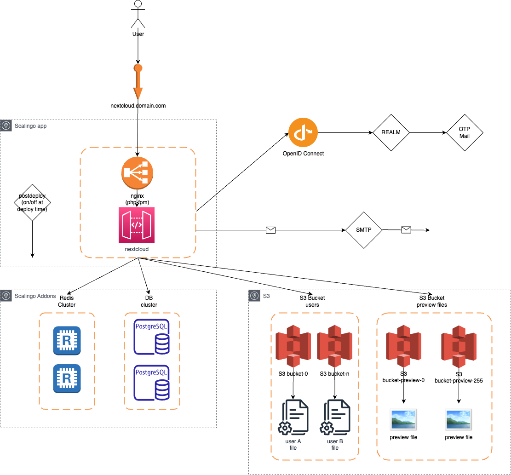

# nextcloud-buildpack
A buildpack for Nextcloud's deployment to Scalingo

For testing purpose

This buildpack configure one single instance of nextcloud with
- php-fpm/nginx buildpack
- Postgresql DB
- Redis cache
- S3 storage
- OpenID connect



## Usage

Create a git repo `my-nextcloud-app` with following files
- `.buildpack`
```
https://github.com/pli01/nextcloud-buildpack#main
https://github.com/Scalingo/php-buildpack
```

- Add custom configuration, with a file `nextconfig_config.json` (copy `nextcloud_config.json.sample`)

This config is minimal and for testing purpose: appstore is disabled, no skeleton, no update checker, and disable all apps

```json
{
  "system": {
    "default_language": "fr",
    "default_locale": "fr",
    "default_phone_region": "FR",
    "skeletondirectory": "",
    "templatedirectory": "",
    "appstoreenabled": false,
    "appstoreurl": "",
    "updatechecker": false
  },
  "apps": {
    "activity": {
      "enabled": "no"
    }
  }
}
```

- Other customisation:
  - Add logo in `nextcloud/core/img/logo/mylogo.png`
  - create theme 

- in scalingo app, define your env file
```bash
#
# default admin user
#
NC_ADMIN_USER=_REPLACE_ADMIN_USER_
NC_ADMIN_PASSWORD=_REPLACE_ADMIN_PASSWORD_
NC_ADMIN_EMAIL=user@domain.com
#
# default passwordsalt
#
NC_CONFIG_PASSWORDSALT="_REPLACE_"
#
# default secret
#
NC_CONFIG_SECRET="_REPLACE_"
#
# Trusted domain
#
NC_TRUSTED_DOMAINS="mydomain.com"
#
# Primary Storage S3 (multi bucket)
#
OBJECTSTORE_S3_SSL=true
OBJECTSTORE_S3_KEY=_REPLACE_
OBJECTSTORE_S3_NUM_BUCKETS=1 # bucket number to store users file
OBJECTSTORE_S3_BUCKET=_REPLACE_ # bucket name is the prefix ot the bucket without number
OBJECTSTORE_S3_HOST=s3.gra.io.cloud.ovh.net
OBJECTSTORE_S3_REGION=gra
OBJECTSTORE_S3_SECRET=_REPLACE_
OBJECTSTORE_S3_AUTOCREATE=true
#
# Theming (login page)
#
NC_THEMING_CONFIG_NAME="Sample"
NC_THEMING_CONFIG_SLOGAN="it works!"
NC_THEMING_CONFIG_URL="github.com"
NC_THEMING_CONFIG_LOGO="/app/nextcloud/core/img/logo/mylogo.png"
#
# (option)
#
NC_CONFIG_JSON_BASE64 : encoded base64 nextcloud_config.json (replace the default nextcloud_config.json)
#
# smtp
#
NC_MAIL_DOMAIN=mydomain.com
NC_MAIL_FROM_ADDRESS=no-reply@mydomain.com
NC_SMTP_AUTHTYPE
NC_SMTP_HOST=smtp.mydomain.com
NC_SMTP_PORT=465
NC_SMTP_NAME=smtp-username
NC_SMTP_PASSWORD=_REPLACE_
NC_SMTP_PASSWORD_FILE
NC_SMTP_SECURE=ssl
#
# openid (oidc)
#
NC_OIDC_LOGIN_CLIENT_ID=_REPLACE_
NC_OIDC_LOGIN_CLIENT_SECRET=_REPLACE_
NC_OIDC_LOGIN_CODE_CHALLENGE_METHOD=S256
NC_OIDC_LOGIN_LOGOUT_URL=https://my-domain.com/apps/oidc_login/oidc
NC_OIDC_LOGIN_PROVIDER_URL=https://oidc.my-domain.com/realms/MY_REALM
NC_OIDC_LOGIN_SCOPE="openid profile email"
```

Add addons:
 - postgresql postgresql-starter-1024
 - redis redis-starter-512

## Local dev environment

There is a development stack based on docker-compose and scalingo images

More information under `docker` directory and README file

## Tips and Docs

### Scalingo command reminder

```
# stop
scalingo --region ${SCALINGO_REGION} --app ${MYAPP} scale web:0
# Create addons
scalingo --region ${SCALINGO_REGION} --app ${MYAPP} addons-add postgresql postgresql-starter-1024
scalingo --region ${SCALINGO_REGION} --app ${MYAPP} addons-add redis redis-starter-512
# start app
scalingo --region ${SCALINGO_REGION} --app ${MYAPP} scale web:1
# bash console
scalingo --region ${SCALINGO_REGION} --app ${MYAPP} run bash
# postgresql console
scalingo --region ${SCALINGO_REGION} --app ${MYAPP} pgsql-console
# redis console
scalingo --region ${SCALINGO_REGION} --app ${MYAPP} redis-console
# build logs
scalingo --region ${SCALINGO_REGION} --app ${MYAPP} deployment-logs
# run logs
scalingo --region ${SCALINGO_REGION} --app ${MYAPP} logs -n 100
```

### Docs
- config: https://docs.nextcloud.com/server/latest/admin_manual/configuration_server/config_sample_php_parameters.html
- occ command: https://docs.nextcloud.com/server/latest/admin_manual/configuration_server/occ_command.html
- nginx configuration: https://docs.nextcloud.com/server/latest/admin_manual/installation/nginx.html#nextcloud-in-the-webroot-of-nginx
- postgresql: https://docs.nextcloud.com/server/latest/admin_manual/configuration_database/linux_database_configuration.html#postgresql-database
- primary storage S3: https://docs.nextcloud.com/server/24/admin_manual/configuration_files/primary_storage.html#simple-storage-service-s3
- scale S3 multi bucket: https://docs.nextcloud.com/server/24/admin_manual/configuration_files/primary_storage.html#multibucket-object-store
- preview in S3 multi bucket: https://docs.nextcloud.com/server/latest/admin_manual/configuration_server/config_sample_php_parameters.html#objectstore-multibucket-preview-distribution
- cache redis: https://docs.nextcloud.com/server/latest/admin_manual/configuration_server/caching_configuration.html?highlight=redis#organizations-with-single-server
- oidc : https://github.com/pulsejet/nextcloud-oidc-login
